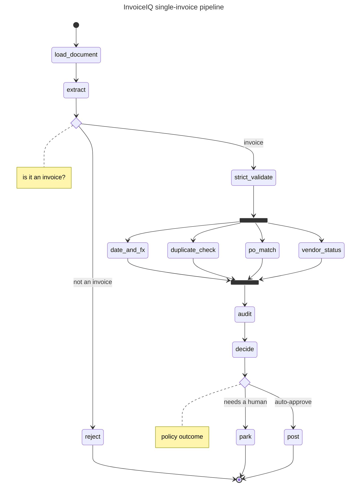

# Pipeline graph

Generated by `uv run python -m invoiceiq.pipeline.graph` from `graph.render()`. A test fails if this file is out of date.

```mermaid
---
title: InvoiceIQ single-invoice pipeline
---
stateDiagram-v2
  load_document
  extract
  state decision <<choice>>
  note right of decision
    is it an invoice?
  end note
  reject
  strict_validate
  state broadcast <<fork>>
  date_and_fx
  duplicate_check
  po_match
  vendor_status
  state collect_findings <<join>>
  audit
  decide
  state decision_2 <<choice>>
  note right of decision_2
    policy outcome
  end note
  park
  post

  [*] --> load_document
  load_document --> extract
  extract --> decision
  decision --> reject: not an invoice
  decision --> strict_validate: invoice
  reject --> [*]
  strict_validate --> broadcast
  broadcast --> date_and_fx
  broadcast --> duplicate_check
  broadcast --> po_match
  broadcast --> vendor_status
  date_and_fx --> collect_findings
  duplicate_check --> collect_findings
  po_match --> collect_findings
  vendor_status --> collect_findings
  collect_findings --> audit
  audit --> decide
  decide --> decision_2
  decision_2 --> park: needs a human
  decision_2 --> post: auto-approve
  park --> [*]
  post --> [*]
```
